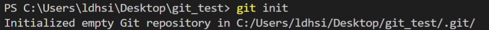
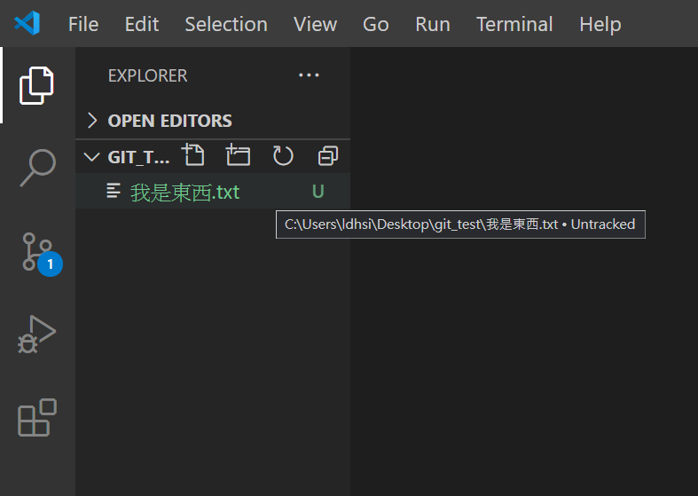
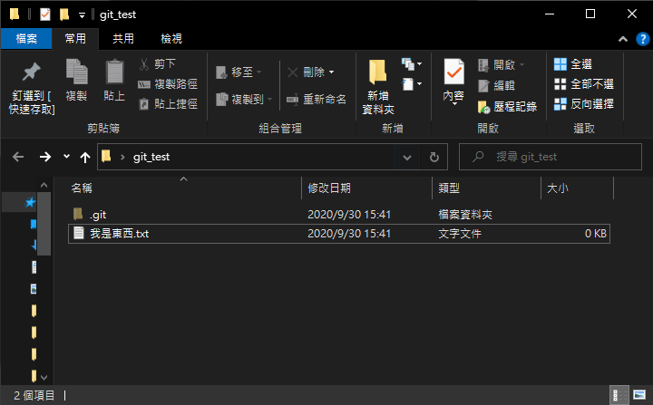
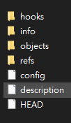
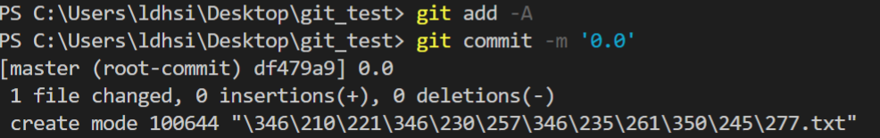
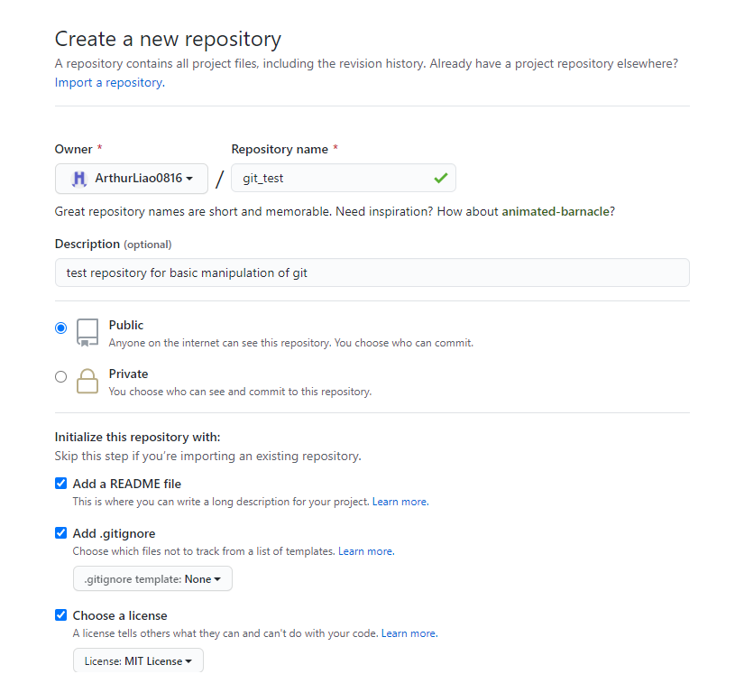
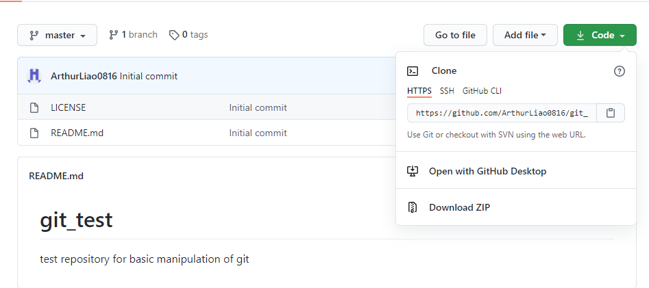
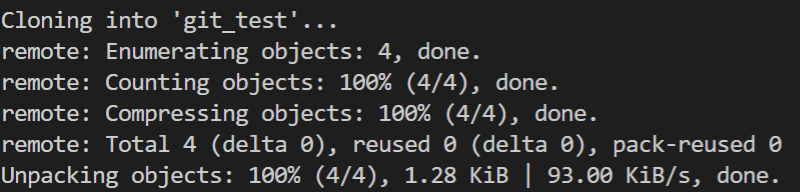
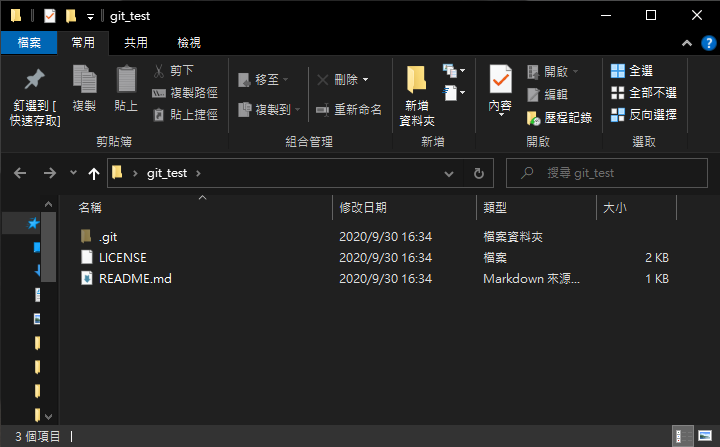

# *git* Learning
---

## 版本控制系統
* 版本控制の意思：紀錄檔案的變化(eg.結構、內容...等)，之後要用可以用
* 版本控制の種類：
    * 本地端版本控制 Local VCS：
        * 在自己的電腦上用 `Ctrl + C` 跟 `Ctrl + V` 對檔案進行管理
        * *缺點*：不能協同開發
    * 集中化的版本控制系統 CVS：
        * 用一個伺服器統一管理所有版本的檔案，客戶端再從伺服器拿檔案出來用
        * *缺點*：伺服器掛了就完蛋了
    * 分散式版本控制系統 DVCSs：
        * 用戶端在跟伺服器要資料的時候，會把整個倉儲做鏡像
        * *缺點*：保密性差

## *git* の特性
* 記錄檔案快照，而不是差異
* 沒網路?沒關係，一樣可以做事，有網路再上傳就好
* 用 `checksum` 阻止非正當修改檔案
* 通常都只增加資料(大一用到現在，基本都在 `git push` 傳資料...
* 將檔案分成四種狀態：
    * `committed`：已經上傳惹 ~
    * `modified`：被改了 ~
    * `staged`：等著要被上傳中...
    * `untracked`：新增的檔案 ~

## *git* の操作
1. 取得倉儲：
    * 在現有資料夾中初始化倉儲：
        * 進入現成の專案資料夾，執行 `git init`
        * 執行完長醬
        
        * 如果資料夾裡面原本就有東西，東西會被歸類為 `Untracked`
        
        * 喔嗚!*git*生成一個隱藏資料夾在我的專案裡面ㄟ，趕快偷看(嘿 ~ 嘿 ~
        
        * 嗯...這蝦毀?不懂。趕緊[逃出來](https://www.youtube.com/watch?v=ro9u_AxB6DY&ab_channel=GlittzyCatDraws) 
        
        * 用 `git add -A` 追蹤所有檔案，再用 `git commit -m '0.0'` 提交內容及版本資訊
        
    * clone 現有倉儲：
        * 創建Git倉儲
        
        * 複製倉儲の url
        
        * 執行 `git clone https://github.com/ArthurLiao0816/git_test.git`
        
        * 成功複製 ~ 
        
